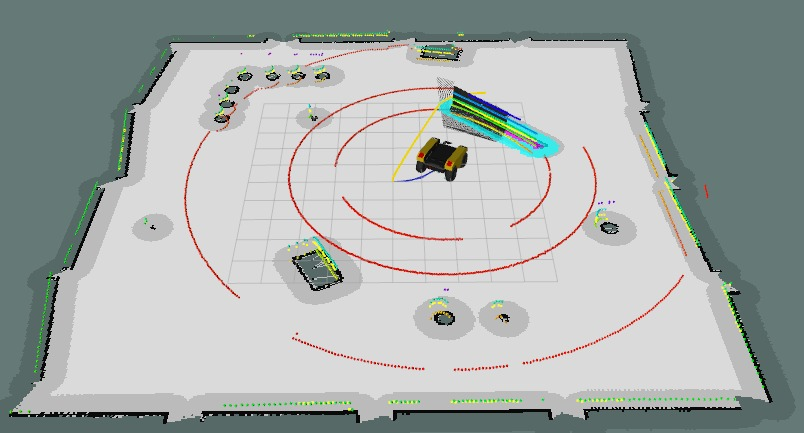

# warthog_navigation



Crie um workspace e clone os pacotes necessários:
``` bash
$ mkdir -p ~/warthog_ws/src 
$ cd ~/warthog_ws/src
$ git clone https://github.com/warthog-cpr/warthog
$ git clone https://github.com/warthog-cpr/warthog_simulator
$ git clone https://github.com/warthog-cpr/warthog_desktop
$ git clone https://github.com/felipe18mohr/warthog_navigation
```

Instale as dependências e compile:
``` bash
Atualizar o package.xml
$ cd ../ && catkin_make
```

No aquivo **accessories.urdf.xacro** do pacote *warthog_description*, adicione as seguintes linhas:
```xml
  <xacro:include filename="$(find velodyne_description)/urdf/VLP-16.urdf.xacro" />
  <xacro:VLP-16 max_range="40" samples="600" hz="5" lasers="8">
    <origin xyz="0.15 0.0 0.7" rpy="0.0 0.0 0.0"/>
  </xacro:VLP-16>

  <xacro:include filename="$(find warthog_navigation)/description/urdf/kinect.urdf.xacro" />
  <xacro:sensor_kinect parent="base_link" cam_px="0.52" cam_py="0.0" cam_pz="0.54" 
                                          cam_or="0.0" cam_op="0.0" cam_oy="0.0" />
  <xacro:sim_3dsensor_kinect/> 
```


Altere as configurações odom0 e imu0 do arquivo **control.yaml** do pacote *warthog_control* para os seguintes:
```yaml
  odom0_config: [false, false, false,
                 false, false, false,
                 true, true, true,
                 false, false, true,
                 false, false, false]
            
  imu0_config: [false, false, false,
                true, true, true,
                false, false, false,
                true, true, true,
                false, false, false]
```

Launch:
``` bash
$ source devel/setup.bash
$ roslaunch warthog_navigation main.launch
```
